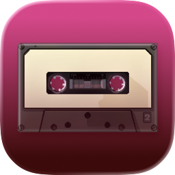

# Jelly Jams



A native **SwiftUI** music client for [Jellyfin](https://jellyfin.org), running on
**macOS**, **iPadOS**, and **iOS** from a single multiplatform target.

I will put this on the app store, and aspire to distribute the Mac app via Homebrew.
Once those things happen, I'll updated this section with info on how to install from
these places.

If you want to use the app before then, you've gotta build it yourself and use xcode
to get it on to your phone.

All communication with Jellyfin is done using their official SDK [`jellyfin-sdk-swift`](https://github.com/jellyfin/jellyfin-sdk-swift)
I pinned the version to 3.1.0, but might change that as I work with the SDK and
better understand what the change process is like.

**Status:** early but usable. The basic playback and navigation all work, however,
playlist management, AirPlay controls, and other stuff still need to be added.

**Not implemented yet:** offline downloads, transcoding (direct play only), lyrics,
ReplayGain, gapless/crossfade, sleep timer, CarPlay, widgets, Quick Connect, and
multiple simultaneous servers.

I expect to be on the App Store in a few weeks, there's no planned Test Flight beta or
anything like that. 

**Platform integration**

- Context menus everywhere: right-click on macOS, long-press on iOS and iPadOS — play,
  shuffle, play next, add to queue, add to playlist, toggle favourite
- Swipe actions on tracks on iOS
- Lock screen, Control Center, and media-key control via `MPRemoteCommandCenter`, with
  artwork in the system Now Playing panel
- Background audio on iOS
- Native macOS **Controls** menu with keyboard shortcuts, and a Settings window showing
  the signed-in user, server, and app version

| Shortcut | Action |
| --- | --- |
| ⌘↩ | Play / Pause |
| ⌘→ | Next track |
| ⌘← | Previous track |
| ⌘⇧S | Toggle shuffle |
| ⌘⇧R | Cycle repeat mode |
| ⌘R | Refresh current view |

## Requirements

- **macOS** with **Xcode 16 or later**
- **[XcodeGen](https://github.com/yonaskolb/XcodeGen)** — `brew install xcodegen`
- A **Jellyfin server**. The pinned SDK is generated from the **Jellyfin 12** API, so a
  Jellyfin 12 server is expected.
- Deployment targets are **macOS 15** and **iOS/iPadOS 18**

## Building

### 1. Generate the Xcode project

`JellyJams.xcodeproj` is generated from `project.yml` and is deliberately **not**
committed, so you must generate it after cloning:

```bash
git clone <this-repo>
cd jellyjams
xcodegen generate
```

You should only need to do this once. You manage your `.xcodeproj` file as normal
once it's generated. 

### 2. Set your signing team

The project uses an environment variable for the Apple Developer Team ID to keep it portable. Before generating the project, set your team ID in your shell (e.g., in `~/.zshrc`):

```bash
export DEVELOPMENT_TEAM=YOUR_TEAM_ID
```

Find your Team ID in Xcode under *Settings → Accounts*, or at [developer.apple.com](https://developer.apple.com/account) under *Membership*. After setting the variable, re-run `xcodegen generate`.

A free Apple ID gives you a personal team, which is enough to build and run locally.

### 3. Build and run

```bash
open JellyJams.xcodeproj
```

Then just use the standard Xcode tools to build test versions of the app.

## Testing

I had Claude write me a huge number of tests. You can run them with ⌘U and while
not perfect, they're reliable enough to catch mistakes that I make or have made.

## License

Mozilla Public License 2.0 — see [LICENSE](LICENSE).

## Finamp

JellyJams isn't a direct fork or clone of the [Finamp](https://github.com/finamp-app/finamp) 
but I have poured over their code extensively. It's a great app that I have consulted countless
times to see real work examples of somebody working with the Jellyfin API as well as inspiration
for layout and design.

## Icon

Icon based on [this stock photo](https://unsplash.com/photos/photo-of-black-and-brown-cassette-tape-FZWivbri0Xk) by [Namroud Gorguis](https://unsplash.com/@namroud).