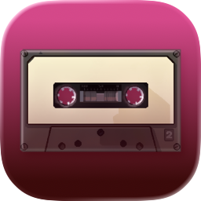

# Jelly Jams



A native **SwiftUI** music client for [Jellyfin](https://jellyfin.org), running on
**macOS**, **iPadOS**, and **iOS** from a single multiplatform target.

**macOS:** download the latest [release](https://github.com/PatrickTCB/JellyJams/releases) —
the app updates itself via [Sparkle](https://sparkle-project.org).

**iOS:** Get it on the App Store. I also aspire to have it on AltStore.

<a href="https://apps.apple.com/us/app/jelly-jams-music/id6804514014" target="_blank">
    
</a>

All communication with Jellyfin is done using their official SDK [`jellyfin-sdk-swift`](https://github.com/jellyfin/jellyfin-sdk-swift). 
I pinned the version to 3.1.0, but might change that as I work with the SDK and
better understand what the change process is like.

As of v1.5, I think this generally usable. It's been my only music player for 3 months now and 
I am officially not embarassed at the thought of people who know me in real life using it.

## Roadmap / ToDo List
No guarantee I'll do any of these things in the next version, but these are all features that 
seem kind of fun and so I will do them at some point.

* transcoding
* lyrics
* Audio normalization
* gapless/crossfade
* sleep timer
* widgets
* Quick Connect.

There's no planned public Test Flight beta or anything like that. The cutting edge is and will 
always be the Mac version released here, with the App Store version being a little more stable. 
So if you want stability on the Mac, you should be able to run the iPad version from the App 
Store without issue.

## What's in the app

It's a music player. You've got all the basics for library navigation, downloads, etc all work. 
This list below is basically the special list of features I think are the most fun.

### Real Siri integration with or without Apple Intelligence
Once you give Siri permission to use your Jelly Jams data you can say "Hey Siri play the song 
Night is Calling by Dominum" and it should work.
You can ask for artists, albums, songs, or playlists. 

You can also set a default action for when you say "Hey Siri, play some music using Jelly Jams".

### Context menus everywhere
Right-click on macOS, long-press on iOS and iPadOS — play, shuffle, play next, add
to queue, add to playlist, and more!

### Swipe actions on iOS
You can swipe songs in basically any list where you see them on iOS in order to access 
likely quick actions.

### Lock screen, Control Center, and media-key control via `MPRemoteCommandCenter`
This helps with the Siri integration and allowing you do stuff like control speaker usage. 
So if you're listening on your homepode in you dungeon and want to also here the music in 
the atrium you can say "Hey Siri, play the music in the atrium too" and it should work.

### Native macOS **Controls** menu with keyboard shortcuts
I'm a huge keyboard shortcut guy. So these are on top of normal media key controls and 
meant to make browsing your library with the keyboard a breeze.

| Shortcut | Action |
| --- | --- |
| ⌘↩ | Play / Pause |
| ⌘→ | Next track |
| ⌘← | Previous track |
| ⌘⇧S | Toggle shuffle |
| ⌘⇧R | Cycle repeat mode |
| ⌘R | Refresh current view |
| ⌘, | Open Settings |

## Requirements

* **macOS** with **Xcode 16 or later**
* **[XcodeGen](https://github.com/yonaskolb/XcodeGen)** — `brew install xcodegen`
* A **Jellyfin server**. The pinned SDK is generated from the **Jellyfin 12** API, so a
  Jellyfin 12 server is expected.
* Deployment targets are **macOS 15** and **iOS/iPadOS 27**

## Building

### 1. Generate the Xcode project

`JellyJams.xcodeproj` is generated from `project.yml` and is deliberately **not**
committed, so you must generate it after cloning:

```bash
git clone https://github.com/PatrickTCB/JellyJams.git
cd JellyJams
xcodegen generate
```

You should only need to do this once. You manage your `.xcodeproj` file as normal
once it's generated. 

### 2. Set your signing team

The project uses an environment variable for the Apple Developer Team ID to keep 
it portable. Before generating the project, set your team ID in your shell (e.g., in `~/.zshrc`):

```bash
export DEVELOPMENT_TEAM=YOUR_TEAM_ID
```

Find your Team ID in Xcode under *Settings → Accounts*, or at [developer.apple.com](https://developer.apple.com/account) under *Membership*. After setting the variable, re-run `xcodegen generate`.

A free Apple ID gives you a personal team, which is enough to build and run locally.

### 3. Build and run

```bash
open JellyJams.xcodeproj
```

Then just use the standard Xcode tools to build test versions of the app.

## Testing

I had different LLMs write me a huge number of tests. You can run them with ⌘U and while
not perfect, they're reliable enough to catch mistakes that I make or have made.

## License

Mozilla Public License 2.0 — see [LICENSE](LICENSE).

## Finamp

Jelly Jams is obviously not a fork or clone of the [Finamp](https://github.com/finamp-app/finamp) 
but I have poured over their code extensively. It's a great app that I have consulted countless
times to see real world examples of somebody working with the Jellyfin API as well as inspiration
for layout and design.

## Icon

Icon based on [this stock photo](https://unsplash.com/photos/photo-of-black-and-brown-cassette-tape-FZWivbri0Xk) by [Namroud Gorguis](https://unsplash.com/@namroud).
